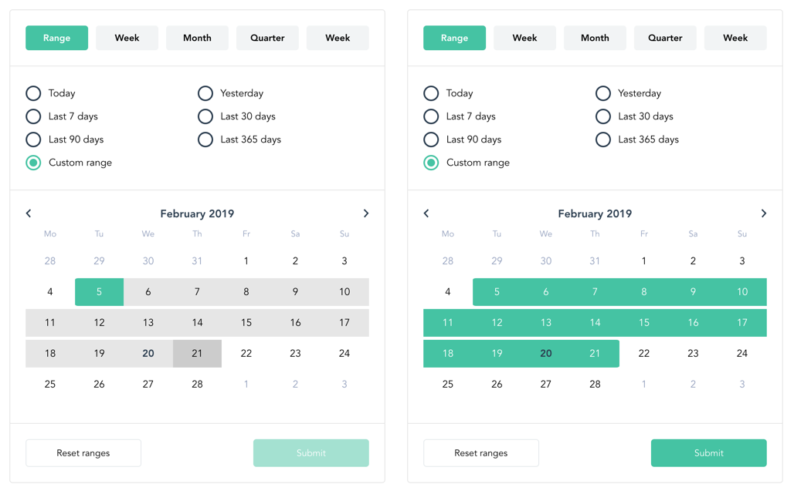

# vue-mj-daterangepicker

<p align="center">
  
</p>

## Installation

You need [Vue.js](https://vuejs.org/) **version 2.0+**.

### 1 Install via npm

```bash
npm install vue-mj-daterangepicker
yarn add vue-mj-daterangepicker
```

### 2 Import and use

```javascript
import Vue from 'vue'
import DateRangePicker from 'vue-mj-daterangepicker'
import 'vue-mj-daterangepicker/dist/vue-mj-daterangepicker.css'

...

Vue.use(DateRangePicker)
```

## Props

| Name              | Type    | Default                                         | Description                                                     |
|-------------------|---------|-------------------------------------------------|-----------------------------------------------------------------|
| `locale`          | String  | en                                              | set the locale ['de', 'es', en', 'fr', 'ru']                    |
| `from`            | String  | null                                            | ISO-8601 date of start range                                    |
| `to`              | String  | null                                            | ISO-8601 date of end range                                      |
| `begin`           | String  | null                                            | ISO-8601 date to display `since beginning` range                |
| `allowFrom`       | String  | null                                            | ISO-8601 date to disable selection of all dates before (strict) |
| `allowTo`         | String  | null                                            | ISO-8601 date to disable selection of all dates after (strict)  |
| `past`            | Boolean | true                                            | allow/disallow user to select past dates                        |
| `future`          | Boolean | true                                            | allow/disallow user to select future dates                      |
| `panel`           | String  | null                                            | choose which panel to be open by default                        |
| `panels`          | Array   | [ 'range', 'week', 'month', 'quarter', 'year' ] | choose which panels to be available                             |
| `yearsCount`      | Number  | 2                                               | number of past/future years to display in `year` panel          |
| `showControls`    | Boolean | true                                            | show bottom controls                                            |
| `theme`           | Object  | see customize section                           | customize colors                                                |
| `width`           | String  | 'auto'                                          | set component width                                             |
| `resetTitle`      | String  | 'Reset'                                         | change Reset button title                                       |
| `submitTitle`     | String  | 'Submit'                                        | change Submit button title                                      |
| `presets`         | Object  | see preset section                              | select which presets to be available                            |
| `rangeDisplayed`  | String  | 'to'                                            | select which range is visible when calendar is displayed        |

### Customize
```javascript
theme = {
  primary: '#3297DB',
  secondary: '#2D3E50',
  ternary: '#93A0BD',
  border: '#e6e6e6',
  light: '#ffffff',
  dark: '#000000',
  hovers: {
    day: '#CCC',
    range: '#e6e6e6'
  }
}
```

### Presets
```
available presets : ['custom', 'today', 'yesterday', 'tomorrow', 'last7days', 'next7days', 'last30days', 'next30days', 'last90days', 'next90days', 'last365days', 'next365days', 'forever']
```
warning: `forever` need `begin` props to be set.

## Events

This datepicker emit three events, @update, @select and @reset

@update is triggered when submit button is clicked.
@select is triggered when a range is selected, can be useful if you don't want to show bottom controls (with showControls = false)
@reset is triggered when reset button is clicked

All return an object with the start and end date, plus the active panel

```javascript
{
  to: '2019-04-23T10:26:00.996Z',
  from: '2018-04-23T10:26:00.996Z'
  panel: 'range'
}
```

## Examples

```vue
<template>
  <date-range-picker :from="$route.query.from" :to="$route.query.to" :panel="$route.query.panel" @update="update"/>
</template>

<script>

export default {
  methods: {
    update(values) {
      this.$router.push({ query: Object.assign({}, this.$route.query, {
        to: values.to,
        from: values.from,
        panel: values.panel
      }) })
    }
  }
}
</script>
```
